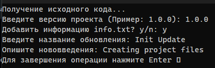

# Portable-Local-Version-Control-
This program help you to keep your program versions and his descriptions , such as commits, maybe
Russian language, but you can make translation.

## Example of use:



Program will create a new directory with name 'v1.0.0' and add file 'info.txt' with text:
```
Init Update
Version: 1.0.0

Creating project files
```
